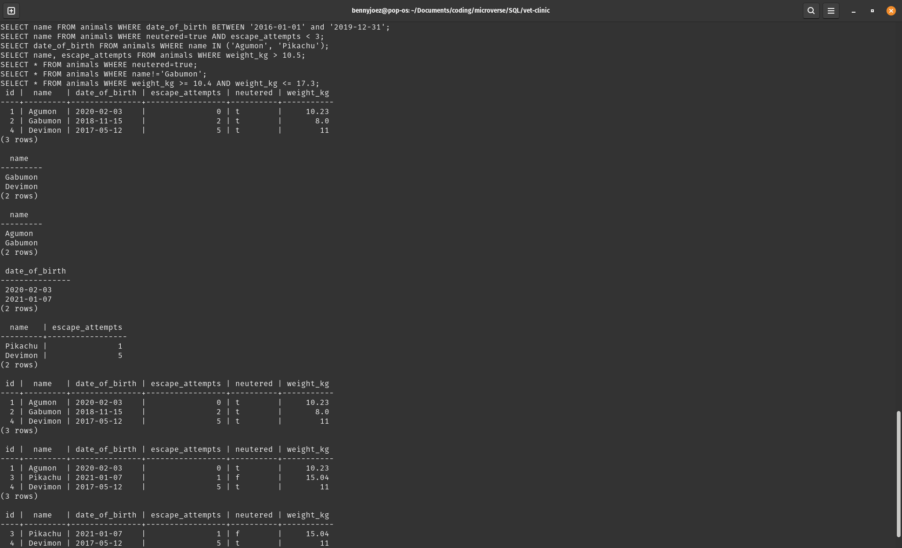

<h1 align=center>Vet Clinic Database</h1>
<a name="readme-top"></a>

<!-- TABLE OF CONTENTS -->

# 📗 Table of Contents

- [📖 About the Project](#about-project)
  - [🛠 Built With](#built-with)
    - [Tech Stack](#tech-stack)
    - [Key Features](#key-features)
  - [🚀 Live Demo](#live-demo)
- [💻 Getting Started](#getting-started)
  - [Setup](#setup)
  - [Prerequisites](#prerequisites)
  - [Install](#install)
  - [Usage](#usage)
  - [Run tests](#run-tests)
  - [Deployment](#triangular_flag_on_post-deployment)
- [👥 Authors](#authors)
- [🔭 Future Features](#future-features)
- [🤝 Contributing](#contributing)
- [⭐️ Show your support](#support)
- [🙏 Acknowledgements](#acknowledgements)
- [❓ FAQ](#faq)
- [📝 License](#license)

<!-- PROJECT DESCRIPTION -->

# 📖 [your_project_name] <a name="about-project"></a>

**[Vet_Clinic_Database]** is a project that was created with a view to enter and manage some data pertaining to a veterinary clinic. The data is about some animals and the data managed includes their clinic ID's, names, date of birth, escape attempts, neutered status and weight in kilograms. The database was created in PostgreSQL and it can be queried to get the needed information.

## 🛠 Built With <a name="built-with"></a>

### Tech Stack <a name="tech-stack"></a>

<details>
<summary>Database</summary>
  <ul>
    <li><a href="https://www.postgresql.org/">PostgreSQL</a></li>
  </ul>
</details>

<p align="right">(<a href="#readme-top">back to top</a>)</p>

<!-- Features -->

### Key Features <a name="key-features"></a>

- **[animals_table]**

<p align="right">(<a href="#readme-top">back to top</a>)</p>

<!-- GETTING STARTED -->

## 💻 Getting Started <a name="getting-started"></a>

To get a local copy up and running, follow these steps:
  - Install PostgreSQL to your machine using this [link](https://www.tutorialspoint.com/postgresql/postgresql_environment.htm) and configure it.
  - Create a database with the name vet_clinic. Tutorial on the [link](https://www.tutorialspoint.com/postgresql/postgresql_create_database.htm).
  - Go into the special Postgres terminal for the created database: 
    ``` sh
    psql vet_clinic
    ```
  - In the postgres terminal, copy and paste the code from the schema.sql file to create the table.
  - copy and paste the code in the data.sql to insert the data of the dogs. 
  - Now you can query the data using the commands on the queries

### Prerequisites

In order to run this project you need:


Install Postgres as shared in getting started.


### Setup

Clone this repository to your desired folder:


Command:

```sh
  mkdir my-folder
  cd my-folder
  git clone https://github.com/microvese-projects/vet-clinic.git
```
-

### Install

No installations required for this. 

### Usage

To run the project, execute the following command:
Go into the special Postgres terminal for the created database: 
  ``` sh
  psql vet_clinic
  ```

### Run tests

Tests are performed by running the queries to verify the data is fed into the DataBASE correctly. 

### Deployment

The project is not deployed.

<p align="right">(<a href="#readme-top">back to top</a>)</p>

<!-- AUTHORS -->

## 👥 Authors <a name="authors"></a>


👤 **Author1**

- GitHub: [@bennyjoez](https://github.com/bennyjoez)
- Twitter: [@bennyjoezz](https://twitter.com/bennyjoezz)
- LinkedIn: [Bennyjoez](https://linkedin.com/in/bennyjoez)

<p align="right">(<a href="#readme-top">back to top</a>)</p>

<!-- FUTURE FEATURES -->

## 🔭 Future Features <a name="future-features"></a>

- [ ] **[Clinic_Personnel_Table]**

<p align="right">(<a href="#readme-top">back to top</a>)</p>

<!-- CONTRIBUTING -->

## 🤝 Contributing <a name="contributing"></a>

Contributions, issues, and feature requests are welcome!

Feel free to check the [issues page](https://github.com/microvese-projects/vet-clinic.git/issues/).

<p align="right">(<a href="#readme-top">back to top</a>)</p>

<!-- SUPPORT -->

## ⭐️ Show your support <a name="support"></a>

If you like this project, you can easily show your appreciation by giving it a star on [github](https://github.com/microvese-projects/vet-clinic.git)

<p align="right">(<a href="#readme-top">back to top</a>)</p>

<!-- ACKNOWLEDGEMENTS -->

## 🙏 Acknowledgments <a name="acknowledgements"></a>

I would like to thank Microverse for the material provided to be able to learn and create this project. 

<p align="right">(<a href="#readme-top">back to top</a>)</p>

<!-- FAQ (optional) -->

## ❓ FAQ <a name="faq"></a>

- **Can I get a local copy of this project?**

  - To get a local copy of this project scroll up to the getting started section to create a local copy.

- **What is the experience is required to install PostgreSQL?**

  - Anyone with any level of experience can install and create a database using PostgreSQL. 

<p align="right">(<a href="#readme-top">back to top</a>)</p>

<!-- LICENSE -->

## 📝 License <a name="license"></a>

This project is [MIT](https://github.com/microvese-projects/vet-clinic/blob/f4caacd6a79b711fd4c003701537208b9251dd7e/LICENSE.md) licensed.

<p align="right">(<a href="#readme-top">back to top</a>)</p>
